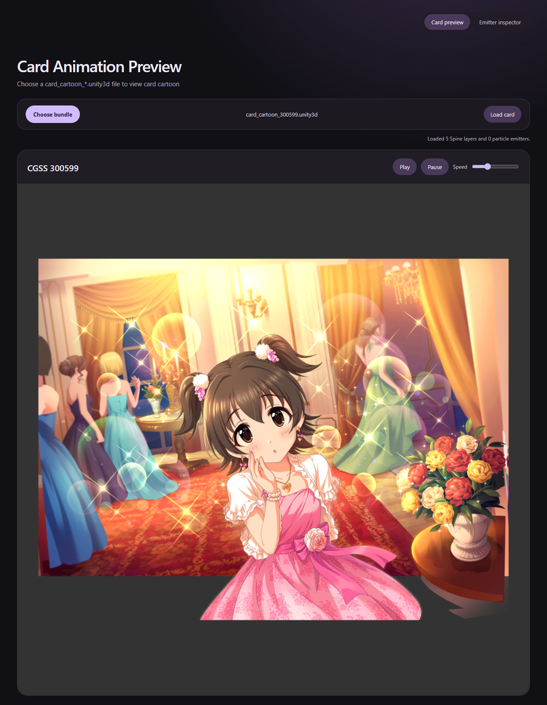
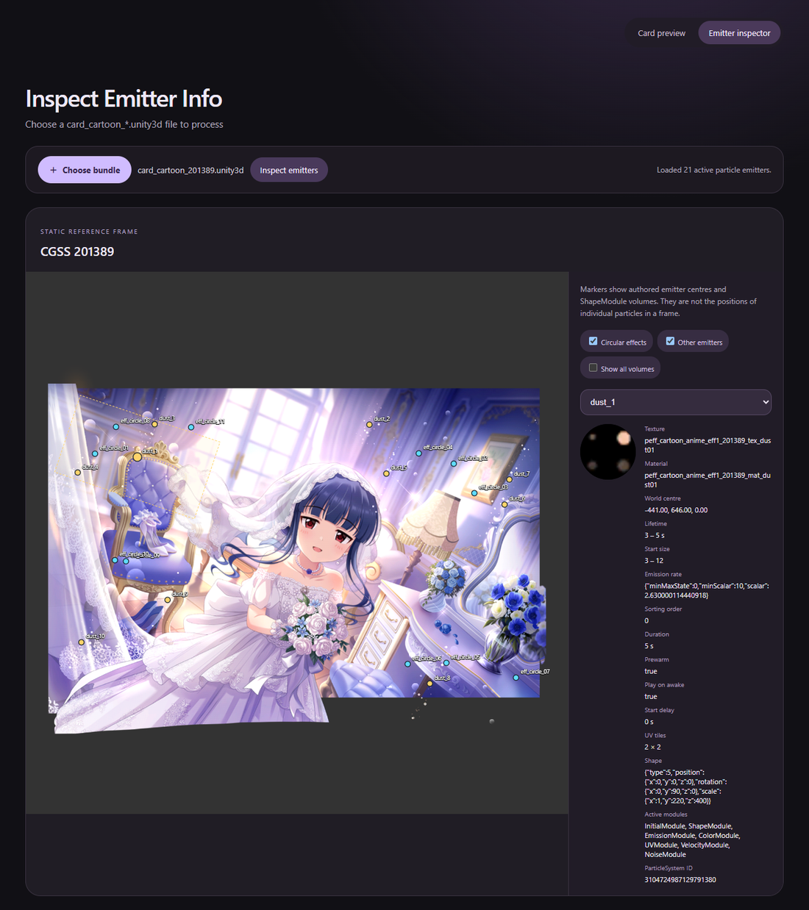
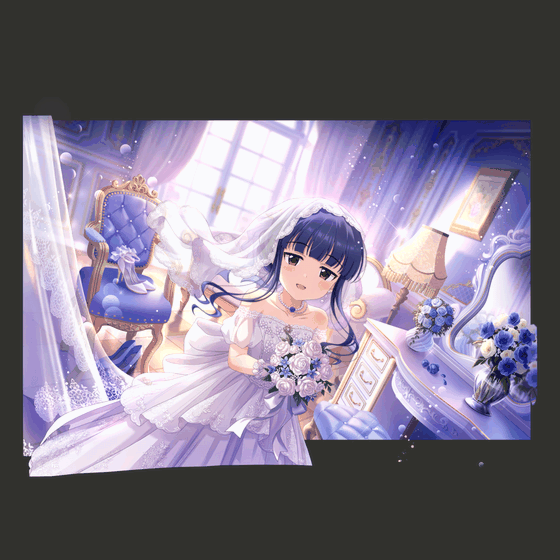
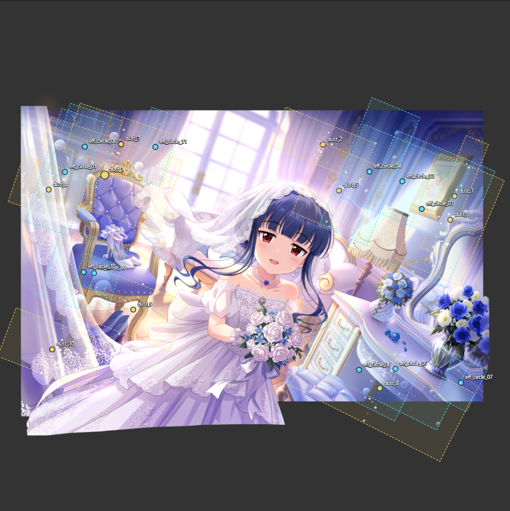

# cgss-cartoon-unify

`cgss-cartoon-unify` previews CGSS `card_cartoon_*.unity3d` bundles in a browser. We read UnityFS data, resolve the card's Spine and particle assets, decode textures, and render the animation locally. The selected bundle stays in the browser.

The repository has two ready-to-use browser entries:

| Entry | Location | Intended use |
|---|---|---|
| Desktop preview | `web/` | Run the repository's small Python server for a local preview. |
| Standalone player | `web-cartoon-player/` | Copy or host this self-contained HTML, CSS, and JavaScript folder with any static HTTP server. It has no Python, Node.js, PowerShell, .NET, or AssetStudio runtime dependency. |

Game bundles and extracted assets are not included. The images below demonstrate the player with game content. Select a bundle you are entitled to use.

## What we added

We built on the CGSS Spine preview work credited below and extended it into a browser-based bundle player and inspection tool:

- **Load the original bundle directly.** Our JavaScript pipeline reads UnityFS, decompresses storage blocks, decodes serialized objects and textures, and follows asset references. You can select one card bundle without manually exporting skeletons, atlases, or textures, and without calling an AssetStudio DLL.
- **Bring particle effects into the preview.** We added playback for referenced particle prefabs, including the bubbles and light specks in the Yukimi example below. The loader follows prefab, renderer, material, and texture references instead of guessing which images to load from their filenames. Cards without particle prefabs also work. Playback uses a subset of Unity particle data with approximate fades, additive compositing, and highlight adjustments.
- **Make the particle data inspectable.** The separate emitter inspector projects authored positions and source volumes onto the card, and exposes textures, materials, transforms, lifetime, emission settings, and sorting metadata.
- **Document the rendering research.** We traced the asset relationships and investigated particle placement, separate RGB/A8 textures, blending, and the limits of the browser shader approximation. [Particle and shader analysis](docs/rendering.md) explains the findings and what still needs work.
- **Package it for reuse.** The project includes a Python-launched local preview, a standalone static site, and a bare player entry for embedding. Parsing runs in a Worker, and shared modules keep the two distributions aligned.

## Screenshots and animation

These captures come from the standalone player. The card preview screenshot uses **300599 — 赤城みりあ「一夜の魔法」**. The animation and particle inspector captures use **201389 — 佐城雪美「あなたに微笑むマドモアゼル」**. They show this project's rendering, including its current particle approximation.

### Card preview interface



### Emitter inspector interface



### Decoded card animation

A six-second recording of the browser player, reduced in size and colour depth for the GIF. Its loop boundary is the end of the recording, not necessarily the end of the card's animation.



### Particle position analysis

The markers show authored emitter centres. The shaded outlines show projected ShapeModule source volumes, rather than the positions of individual bubbles in a frame. This capture has **Show all volumes** enabled.



## Quick start

### Online preview

The standalone player is published through GitHub Pages:

https://kinomotokazari.github.io/cgss-cartoon-unify/

Choose a `card_cartoon_*.unity3d` file and click **Load card** to preview it. The bundle is processed locally by your browser and is not uploaded to a server.

The hosted [emitter inspector](https://kinomotokazari.github.io/cgss-cartoon-unify/emitter_debug.html) and [bare player](https://kinomotokazari.github.io/cgss-cartoon-unify/player.html) are also available directly.

### Desktop preview

Requirements: Python 3.10+ and a current browser with WebGL. No packages need to be installed.

From the repository root, run:

```sh
python run.py
```

The page opens automatically. Choose a `card_cartoon_*.unity3d` file, then select **Load card**. **Pause**, **Play**, and **Speed** control playback. Keep the terminal open while the page is in use. Press Ctrl+C to stop the server.

The separate emitter-position diagnostic is available at `http://127.0.0.1:<port>/emitter_debug.html`, using the port printed by `run.py`.

`http://127.0.0.1:<port>/player.html` is the bare embed entry. It initially shows only the native bundle selector. The animation canvas appears after a file is selected. It has no stylesheet, title, navigation, status text, or playback controls.

Useful options:

```sh
python run.py --no-browser
python run.py --port 8080
```

The command also works in an activated Anaconda environment. Open the HTTP address printed by the command if the browser does not open automatically.

### Standalone HTML player

`web-cartoon-player/` is a regular static site containing only HTML, CSS, and JavaScript. It includes the parser, texture decoder, player UI, and runtime files needed for the standalone page.

Serve that folder from any static HTTP server. For example, with Python:

```sh
cd web-cartoon-player
python -m http.server 8000
```

Open `http://127.0.0.1:8000/`, select a `card_cartoon_*.unity3d` file, and click **Load card**. `py -m http.server 8000` is an equivalent Windows command when `py` is available.

Do not open `index.html` with `file://`: the parser runs in an ES-module Worker, which browsers restrict for local-file pages. Any ordinary local or hosted static HTTP server is sufficient.

Open `http://127.0.0.1:8000/emitter_debug.html` for the standalone emitter-position diagnostic. It overlays authored particle-emitter centres and ShapeModule volumes, lets you filter circular effects and other emitters, and shows the selected system's material, texture, Transform-derived world position, lifetime, emission data, and renderer sorting order. The diagnostic page pauses after drawing its initial reference frame. It does not claim to reproduce Unity's final scene sorting.

Open `http://127.0.0.1:8000/player.html` when embedding only the file input and animation canvas in another page. The page deliberately has no stylesheet or controls beyond the native file input. The canvas is hidden until a bundle is selected.

### Page entries

| Page | Behaviour |
|---|---|
| `/` (desktop) or `index.html` (standalone) | Card animation with Play, Pause, Speed, and loading cancellation |
| `emitter_debug.html` | One static reference frame with emitter markers, source volumes, and diagnostic fields |
| `player.html` | Unstyled file selector. Selecting a bundle starts loading and playback automatically |

The bare player reports loading errors in the browser console. If it appears empty, scroll to the top for **Choose card bundle**, then reload to pick up updated files. A static server's HTTP 304 response is cache validation, not a missing-page error.

## What is supported

| Component | Support |
|---|---|
| Container | UnityFS 6 and 7 |
| Compression | Raw, LZ4, and LZ4HC |
| Serialized files | Versions 17 and 22 with embedded TypeTrees |
| Textures | RGB565, Alpha8, ETC_RGB4, RGB24, and RGBA32 |
| Card layers | Five Spine layers using one atlas page |
| References | File-aware 64-bit PPtrs when the referenced files are inside the selected bundle |

The scene keeps the original preview's coordinate conversion, RGB/A8 composition, and layer order: `bg → eff2 → chara → eff1 → fg`. Particle textures are discovered through prefab and material references. We approximate Unity particle playback, including its fades and highlights. For the data flow, current shader approximation, and known gaps, see [Particle and shader analysis](docs/rendering.md).

We developed against two representative cards. **201389 — 佐城雪美「あなたに微笑むマドモアゼル」** is a later card-animation version with particles. **300599 — 赤城みりあ「一夜の魔法」** is an earlier version without particles. Together they cover the two animation generations we wanted to support first. Other versions, codecs, missing TypeTrees, or external dependencies report an error.

## Project layout

| Path | Purpose |
|---|---|
| `src/` | Canonical parser and card assembly. `src/loader-worker.js` keeps reading and parsing off the main thread. |
| `web/` | Desktop pages and canonical shared viewer, load-session, and inspector modules. |
| `runtime/` | Spine 3.6 and CGSS skeleton runtime used by the desktop preview. |
| `web-cartoon-player/` | Self-contained static player. `index.html` is the card preview, `emitter_debug.html` is the emitter diagnostic, and `player.html` is the unstyled embed entry. Its `src/` and `runtime/` copies let it be served independently. |
| `run.py` | Standard-library local static server for `web/`. |
| `tests/` | Parser tests, optional real-bundle integration checks, and browser smoke checks. |
| `scripts/sync-standalone.mjs` | Synchronizes shared JavaScript into the standalone folder. `--check` reports drift without writing. |
| `docs/validation.md` | Scope and results of the verification work. |
| `docs/rendering.md` | Particle discovery, playback approximation, and shader/compositing analysis. |
| `licenses/`, `THIRD_PARTY_NOTICES.md` | Third-party notices and license texts. |

## Module ownership

| Module | Responsibility |
|---|---|
| `src/` | Bundle decoding, references, textures, and card assembly |
| `src/loader-worker.js` | Read a file or URL, enforce the input limit, then transfer the parsed card |
| `web/load-session.js` | Own the active load and viewer, then discard cancelled results |
| `web/viewer.js` | Assemble renderers, advance frames, and release resources |
| `web/particle-overlay.js` | Approximate particle playback and preview appearance |
| `web/particle-inspector.js` | Show authored emitter positions, source volumes, and diagnostic fields |
| `web/preview-page.js`, `web/embed-player.js` | Bind the static page controls |
| `web-cartoon-player/player.js` | Build the standalone player UI |
| `run.py` | Serve the local frontend files |

## Remaining limits

Particle playback is an approximation, not a complete Unity particle or shader implementation. We sample a subset of modules, composite particles after Spine, and use preview-specific fades and contrast. The player uses planar transforms while the inspector projects full Transform and Shape rotations. Exact curves, scene sorting, and shader equivalence need separate rendering work and visual reference data.

The CGSS skeleton parser supports the custom binary header used by the tested cards. Other skeleton formats and exhaustive malformed-input handling need separate parser work. The current tests do not prove support for every CGSS asset.

The standalone folder contains committed copies so it can be hosted on its own. Run `npm run sync:standalone` after changing shared code, then run `npm run check:standalone`. The script defines the synchronized page modules. Standalone HTML, CSS, `player.js`, and `standalone.js` are maintained directly.

## Validation

We check parser failures, cancellation during viewer construction, error recovery, both reference cards and their RGBA hashes, and both browser distributions. Browser checks cover card swapping, pause, the static emitter reference frame, visible diagnostic fields, and the bare player entry.

The post-refactor run passed 14 tests with both reference bundles, both browser smoke checks, and the standalone drift check. [Validation](docs/validation.md) records the commands, reference data, and test scope.

## Development checks

Node.js is used for development checks and syncing shared files, not for running either player.

The canonical parser and runtime sources are in `src/` and `runtime/`. Shared viewer and loading modules live in `web/`. After editing these files, update the standalone copies and check for drift:

```sh
npm run sync:standalone
npm run check:standalone
```

The standalone HTML, CSS, `player.js`, and `standalone.js` are maintained directly in `web-cartoon-player/`. The sync script only copies shared JavaScript and adjusts the worker's relative URL. Users do not need Node.js to run the resulting folder.

Shared entry scripts such as `embed-player.js` and `emitter-debug.js` are also synchronized. Edit their canonical versions in `web/`. Direct edits to synchronized copies are overwritten. HTML and CSS are not synchronized.

```sh
node --test tests/*.test.mjs
```

Set `CGSS_BUNDLE_DIR` to a directory containing the two tested card bundles to run the optional integration checks. Without it, those tests are explicitly skipped.

The optional browser smoke test requires Playwright and Edge:

```sh
npm install --no-save --package-lock=false playwright
node tests/browser-smoke.mjs /path/to/bundles
node tests/standalone-browser-smoke.mjs /path/to/bundles
```

The first command starts `run.py`. Use `PYTHON` to select its Python executable. The second starts its own Node.js static server and does not need Python. Both accept `BROWSER_CHANNEL` to select another installed Playwright browser channel. The desktop check saves screenshots in the ignored `test-output/` directory. Standalone comparisons stay in memory.

See [Validation](docs/validation.md) for tested cards, assertions, and limits.

## Credits

We are very grateful to [BA-Momoi's CGSS Resource Tool](https://github.com/BA-Momoi/cgss-resource-tool), especially its spine_preview. Its clear treatment of card layer order, RGB/A8 atlas composition, Y-axis conversion, scene fitting, and Spine blend modes gave this player a strong technical starting point.

We are very thankful to [MDUI](https://www.mdui.org/) for its thoughtful Material Design direction, which inspired the local preview and inspector interface.

We built the UnityFS, SerializedFile, TypeTree, and shared-string handling with [AssetStudio](https://github.com/Perfare/AssetStudio) as the reference. AssetStudio is MIT licensed. This repository does not distribute or load AssetStudio binaries.

The bundled Spine core and canvas runtime come from [Spine Runtimes](https://github.com/EsotericSoftware/spine-runtimes) 3.6 by Esoteric Software. They are distributed under the Spine Runtimes Software License v2.5.

## License notices

The original code and documentation in this repository are available under the [MIT License](LICENSE). Third-party runtime files and adapted material retain their own terms. See [Third-party notices](THIRD_PARTY_NOTICES.md) for file-level provenance. [licenses/README.md](licenses/README.md) maps each included license text to the component it covers.

## Game assets and rights

The game resources, original animation presentation, and related copyrights belong to Cygames and Bandai Namco Entertainment Inc. (BNEI).

Please do not use this project or any derivative works in ways that infringe the rights of the copyright holders or harm their legitimate interests. The example screenshots and animation do not grant permission to reuse or redistribute the underlying game resources.
