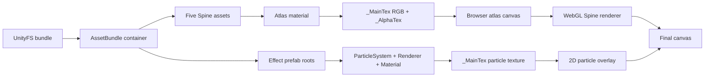

# Particle and shader analysis

This document describes the renderer that is in this repository. It distinguishes data that comes directly from a Unity bundle from browser-side behaviour that approximates Unity. The desktop preview and `web-cartoon-player/` use the same rendering model.

The [complete 100612 audit](100612-bundle-audit.md) checks every source object against the supplied exports. Its RGB gradients, shader doubling/saturation and total-speed corrections are now implemented. Particle depth sorting remains unresolved.

The [100263 leaf audit](100263-bundle-audit.md) led to cone-base emission, randomized ForceModule acceleration and initial RandomColor support. Noise-driven size/rotation remain unsupported. It also shows why stale material properties and filename-based texture matching are unreliable.

## Rendering path



`src/card-loader.js` locates card entries through the `AssetBundle.m_Container` path. It requires the five named card skeleton layers and sorts them as `bg → eff2 → chara → eff1 → fg`. It also examines every card `GameObject` entry whose hierarchy contains a `ParticleSystem`. We do not use a texture filename convention. This is why a card can include extra effect textures such as bubble images without a hard-coded list, while cards without an effect prefab do not create particle emitters.

The loader records hierarchy nodes, active state, and Transform ancestry in `plan.effectPrefabs`. Referenced object data and material properties live in `plan.objects`, while decoded texture buffers are in `card.textures`. The Worker transfers that plan and decoded RGBA buffers to the page. `particle-overlay.js` resolves the same reference chain at playback time:

```text
ParticleSystemRenderer.m_Materials[0]
  → Material.m_SavedProperties.m_TexEnvs._MainTex
  → Texture2D
```

The material `_Color` is retained and multiplied into particle RGBA. A missing texture referenced by an active emitter is an explicit load error. We do not silently substitute a bubble image.

## Particle simulation

Playback treats a `ParticleSystem` as an emitter when its GameObject is active, `EmissionModule.enabled` is true, and a `ParticleSystemRenderer` is present and not explicitly disabled. The browser model reads the following serialized values:

| Unity data | Browser behaviour |
|---|---|
| `InitialModule.startLifetime` | Particle lifetime. A scalar or the scalar/min-scalar random range is selected deterministically. |
| `InitialModule.startSize` | Draw size in scene units, then transformed by the Spine scene fit. |
| `InitialModule.startColor` | Color, Gradient, TwoColors, TwoGradients and RandomColor, including independent RGB/alpha key counts. |
| `InitialModule.maxNumParticles` | Upper bound for the generated particle count. |
| `EmissionModule.rateOverTime` | Schedules continuous births on a fixed simulation clock. |
| `ShapeModule.m_Position` and `m_Scale` | Box volume or cone base disk, followed by shape scale, rotation and translation. |
| `VelocityModule.x/y/z` | Combines module velocity with initial velocity and accumulated force before applying speedModifier. |
| `ColorModule.gradient` | RGB and alpha evaluation across normalized lifetime, with a stable per-particle random weight. |
| `ForceModule` | Integrates local/world acceleration at 60 Hz, with per-tick randomization when requested. |
| `UVModule` | Samples start frame and frame-over-time across the whole texture sheet. |
| `NoiseModule` | Adds a deterministic browser-side value-noise offset from the serialized module settings. |
| `SizeModule` | Scales particle width and height over normalized lifetime. |
| `InitialModule.gravityModifier` | Multiplies a configurable gravity vector. The default is `{x: 0, y: -9.81}`. |
| `simulationSpeed`, `prewarm`, `lengthInSec` | Advances the emitter clock, including a simulated prewarm loop. |
| GameObject Transform chain | Applies local scale, quaternion rotation, position, and ancestors before conversion to canvas space. |

Particles are procedural rather than stored frame by frame. `web/particle-simulation.js` advances each emitter at 60 Hz, accumulates `rateOverTime`, creates particles when the emission credit crosses a birth boundary, and removes each particle after its own lifetime. `autoRandomSeed = false` uses the serialized `randomSeed`; automatic seeds use a browser-generated seed for that load. Prewarm simulates one authored loop before the emitter becomes visible.

### Color and material output

We evaluate authored start color, lifetime color and material color together. Only active gradient keys are read. Fixed gradients keep their steps, and TwoGradients use one random blend weight throughout a particle's lifetime.

The loader retains shader names from `m_ParsedForm.m_Name` and pass states even when the top-level name is empty. Playback resolves the pass's blend-property bindings. Unused saved properties such as `_SrcBlend` do not override `_BlendSrc` when the shader binds the latter.

The two supported particle equations are:

- `CommonParticle/Standard/Blend`: clamp `2 × textureRGBA × particleRGBA × materialRGBA` to [0, 1].
- `CommonParticle/TexAlpha/Simple/Blend`: multiply texture RGB and its referenced alpha mask by particle and material RGBA.

An Alpha8 texture supplies A, while a color mask supplies red. RGBA is shaded before Canvas applies SrcAlpha/One (`lighter`) or SrcAlpha/OneMinusSrcAlpha (`source-over`). Other shader/blend combinations report an unsupported-state error. This replaces the earlier RGB squaring, highlight gain and generic fade envelope. Fades now come from authored colors and curves.

`particle-motion.js` owns shape sampling and accumulated force. `particle-color.js` owns gradient evaluation and fragment color calculations. `particle-simulation.js` owns birth/death scheduling and fixed ticks, including prewarm. Noise remains a deterministic browser approximation affecting position only. We do not yet reproduce Unity's rotation/size noise, random kernel, camera or full 3D billboard behaviour.

### Reference-card findings

The inspected particle card, 201389, contains one effect prefab with 22 `ParticleSystem` components. Its root system has emission disabled and no usable material. The 21 child emitters are the visible systems. They are active, looped, use `playOnAwake`, have no start delay, and are prewarmed. The preview therefore begins their shared clock when the card viewer is created and does not reset that clock when the Spine animation loops or playback resumes.

Its point emitters use a `2 × 2` texture sheet, while the circular emitters use individual bubble textures. The particle material fields identify `CommonParticle/Standard/Blend` with saved source-alpha/additive blending values. The exported shader text also describes a brightened particle colour, but Unity shader bytecode is not executed by this project. The Canvas `lighter` path remains an approximation of those material settings, rather than a claim of shader-equivalent output.

## Particle order and limits

All Spine layers are rendered first, then all particles are composited on the final 2D canvas. Emitters are sorted by their serialized sorting-layer index and signed sorting order, with discovery order as a stable tie-breaker. Sorting-layer IDs are not interpreted as numeric priorities. This corrects ordering between particle renderers, but does **not** establish their order relative to Spine. Render queues, depth buffers, game-side order overrides and per-particle sorting are still unsupported. An effect that should pass behind a character can therefore still appear in front.

The following Unity particle features are not implemented or are only partially represented:

- Burst emission, rate-over-distance, duration/loop stop semantics, and explicit simulation space.
- Shapes other than Box and random cone-base emission, plus non-random cone arc modes.
- Trails, collision, sub-emitters, external force fields, and custom vertex streams.
- Limit velocity, inherit velocity, external forces, lights, and custom simulation jobs.
- Weighted curve tangents, noise-driven rotation/size, and particle shaders beyond the two supported equations.
- Unity renderer sorting, soft particles, depth fading, fog, bloom, and post-processing.

These omissions are deliberate boundaries of the browser preview. A closer Unity reproduction would need a broader Shuriken simulation and a particle shader pipeline rather than further brightness constants.

## Emitter position inspector

The card preview and the position inspector are separate pages. The desktop server maps `/` to the card preview and `/emitter_debug.html` to the inspector. The standalone folder provides `index.html` and `emitter_debug.html`. The inspector is generated from the bundle currently loaded. It does not rely on a list of bubble names or precomputed coordinates for a particular card.

The inspector explicitly calls `renderOnce()` and pauses, so its background is a static reference frame. Its discovery requires an active GameObject, enabled emission, a renderer, and a texture reference. Unlike playback, it currently does not check `renderer.m_Enabled`, so disabled renderers can still appear as diagnostics.

For each discovered emitter, it displays the Transform-derived world centre, the projected ShapeModule volume, particle texture and material, lifetime, start size, emission configuration, prewarm/play-on-awake flags, UV tiles, enabled modules, `ParticleSystem` ID, and `ParticleSystemRenderer.m_SortingOrder`. The SVG overlay uses the same scene fit and one Y reflection as the rendered card.

To calculate a volume, the inspector expands all eight corners of `ShapeModule.m_Scale`, applies `ShapeModule.m_Rotation` in Unity Z-X-Y Euler order and `ShapeModule.m_Position`, then applies the emitter Transform and every ancestor Transform. It projects the resulting points to the canvas and draws their two-dimensional convex hull. A marker is the authored emitter centre, not a sampled particle position. A volume is the module's authored bounds, not its noise- or velocity-expanded path.

Circular effects are identified only for the inspector's filter colour by the current `eff_circle` GameObject naming convention. Emitter discovery itself is reference-based. `sortingOrder` is shown as evidence from the source asset and is not converted into a five-Spine-layer index, because the bundle alone does not prove the game-side parent transform or cross-renderer order override.

## Spine atlas composition

CGSS cards use a material with separate RGB and alpha Texture2D references. `viewer.js` builds an atlas canvas by drawing `_MainTex`, then applying `_AlphaTex` with Canvas 2D `destination-in`. This composes the final alpha before the image reaches WebGL and avoids the black-background artifact that appears when RGB texture data is treated as already-transparent pixels.

Texture decoding accepts Alpha8, RGB24, RGBA32, RGB565, and ETC_RGB4. Unity texture rows are flipped from bottom-to-top into browser image order. The renderer requires one atlas page and matching RGB/alpha dimensions. Multi-page Spine atlases currently fail with an explanatory error.

## Spine WebGL shader

`runtime/spine-webgl.js` contains a small WebGL 1 renderer for Spine regions and meshes. It renders each layer's attachment draw order as triangles, batches consecutive triangles with the same texture and blend mode, and uses linear filtering plus clamp-to-edge texture wrapping.

The vertex shader receives already transformed normalized-device coordinates, UVs, and Spine colour values. The fragment shader samples the composited atlas and uses premultiplied output:

```glsl
vec4 t = texture2D(uTex, vUV);
float a = t.a * vColor.a;
gl_FragColor = vec4(t.rgb * vColor.rgb * a, a);
```

The renderer multiplies skeleton, slot, and attachment colours before passing `vColor`. It maps Spine blend modes to the following WebGL blend functions:

| Spine slot blend | WebGL source / destination |
|---|---|
| Normal | `ONE`, `ONE_MINUS_SRC_ALPHA` |
| Additive | `ONE`, `ONE` |
| Multiply | `DST_COLOR`, `ONE_MINUS_SRC_ALPHA` |
| Screen | `ONE`, `ONE_MINUS_SRC_COLOR` |

The WebGL canvas is copied to the visible canvas before the 2D particle overlay draws. The dedicated shader is for Spine geometry only. Unity `Shader` references are retained as metadata, but their bodies are not decoded or traversed, so the project does not execute, translate, or inspect Unity shader bytecode. For particles, the only Unity material properties currently consumed are `_MainTex` and `_Color`. Their glow comes from the browser-side texture transform and additive Canvas compositing described above.

## Where to change the preview

| Goal | Primary file |
|---|---|
| Discover additional particle asset data | `src/card-loader.js` |
| Preserve more serialized material or renderer fields | `src/card-loader.js` |
| Change particle timing, fade, sampling, or glow | `web/particle-overlay.js` |
| Change scene fitting or atlas RGB/alpha composition | `web/viewer.js` |
| Change Spine geometry shader or slot blending | `runtime/spine-webgl.js` |
| Change loading cancellation and viewer ownership | `web/load-session.js` |
| Change static inspector setup | `web/preview-page.js` |
| Change emitter markers or diagnostic fields | `web/particle-inspector.js` |

Edit the canonical files listed above, then run `npm run sync:standalone` and `npm run check:standalone` from the repository root. The standalone copies are distribution outputs. Do not maintain them by hand. Run the relevant browser checks after rendering changes. The [README](../README.md) lists module ownership and limits. [Validation](validation.md) lists the test commands.
